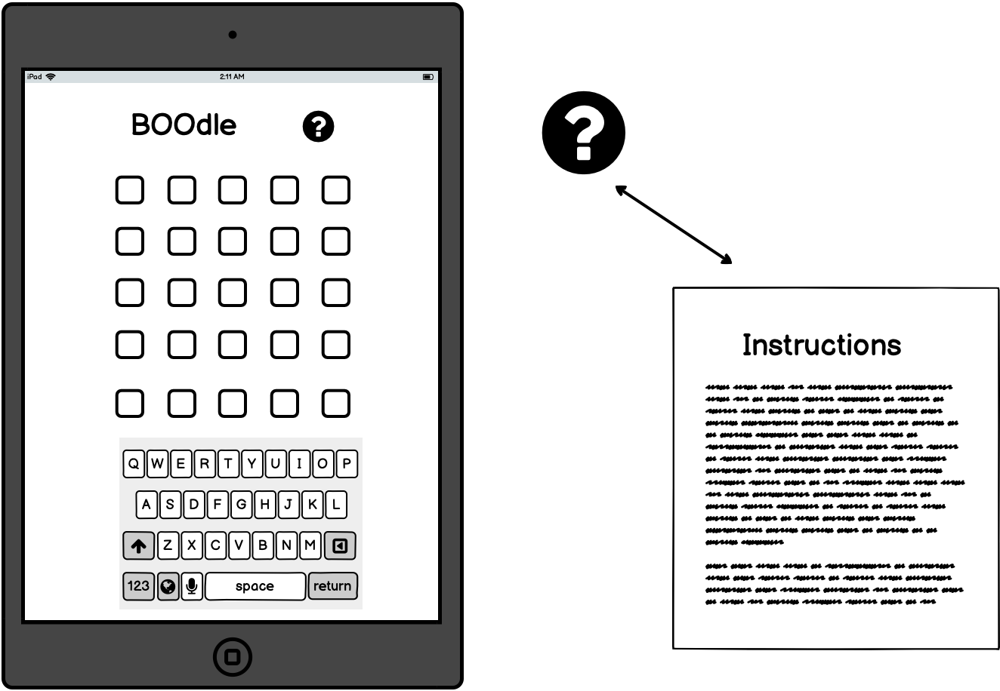

     

- [Link to live website](https://gracemcken.github.io/BOOdle/)
- [Link to repo](https://github.com/gracemcken/BOOdle)
# Table of Contents

- [Table of Contents](#table-of-contents)
- [Site Overview](#site-overview)
  - [Goal](#goal)
  - [Technologies used](#technologies-used)
- [UX](#ux)
  - [Target Audience](#target-audience)
  - [User Stories](#user-stories)
- [Features](#features)
  - [Existing Features](#existing-features)
    - [Rules Button](#rules-button)
    - [Music Toggle](#music-toggle)
    - [The Game Tiles and Keyboard](#the-game-tiles-and-keyboard)
    - [Win Screen and Refresh](#win-screen-and-refresh)
    - [Game Over and Refresh](#game-over-and-refresh)
  - [Future Features](#future-features)
- [Design](#design)
  - [Wireframes](#wireframes)
    - [Desktop](#desktop)
    - [Tablet](#tablet)
    - [Mobile](#mobile)
  - [Typography](#typography)
  - [Colour Scheme](#colour-scheme)
  - [Bugs](#bugs)
  - [Known Issues](#known-issues)
- [Credits](#credits)
    - [Images](#images)
    - [Music](#music)
    - [Version Control](#version-control)
- [Acknowledgments](#acknowledgments)

# Site Overview

## Goal
The goal of this project was to produce a game based on the famous puzzle 'Wordle', while adding my own personalized spin on it. I wanted to make a puzzle game that would appeal more to children around Halloween time, using words that they would be familiar with during the month of October. I thought this would be a fun way to introduce children to games like 'Wordle', which can be quite difficult for those with a smaller vocabulary than adults. By making it Halloween themed and using words children see every year around this time, it would be introducing them to the concept of 'Wordle' without the frustrations of the word being something they have never heard of before.

## Technologies used

- [HTML5](https://en.wikipedia.org/wiki/HTML5) for the contents and structure of the website.
- [CSS3](https://en.wikipedia.org/wiki/CSS) for the styling and animations.
- [Flexbox](https://www.w3schools.com/css/css3_flexbox.asp)
- [Balsamiq](https://balsamiq.com/) for wireframing.
- [GitPod](https://gitpod.io/) as a local IDE & repository.
- [GitHub](https://github.com/) as a remote repository.
- [GitHub Pages](https://pages.github.com/) to deploy the website.
- [Chrome Developer Tools](https://developer.chrome.com/docs/devtools/) for testing screen sizes and using [Lighthouse](https://developers.google.com/web/tools/lighthouse).
- [Wave Chrome extension](https://wave.webaim.org/) to check web accessibility.
- [Am I Responsive](http://ami.responsivedesign.is/) for testing and to make responsive image.
- [JS](https://developer.mozilla.org/en-US/docs/Web/JavaScript) functions and examples.
- [Visual Studio Code](https://code.visualstudio.com/) as a local IDE & repository.
- [Favicon.io](https://favicon.io/favicon-generator/) to create a favicon.
- [Font Awesome](https://fontawesome.com/) for icons.
- [Red Route](https://red-route.org/code/image-resizing-calculator) to help with size calculations for my keyboard buttons.
- [WAVE](https://wave.webaim.org/)

# UX
## Target Audience
My main target audience for this game would be children and those who prefer 

## User Stories

# Features

## Existing Features
### Rules Button
To ensure the user understands the rules of the game, I included a modal that fills the screen when the rules button is clicked. While the modal is active, and overlay covers the rest of the screen and prevents the user from clicking on anything else until they close it.

### Music Toggle
I decided I wanted to add some atmospheric music to the game, however was very aware that people do not enjoy autoplaying music. The solution to this was a toggle at the top of the game beside the rules button. The user simply clicks it once to start the music, and then can click it again to pause it. If the user wants to continue the music, all they have to do is click again and it will resume where it had been paused.

### The Game Tiles and Keyboard
Our main game appearance is very similar to the original Wordle game, although colours are different to suit our theme. Once a word is typed in and enter is clicked, it will trigger a flipping animation on the tiles; changing tile colour depending on whether or not a letter is present in the word, present in the word but in the wrong place, or present in the word and in the correct place. At the same time, the keys pressed also change colour.

### Win Screen and Refresh
If you guess the correct word, a pop up message will appear containing a button that when clicked, will refresh the page and restart the game. 

### Game Over and Refresh
Similarly, if you use up all of your attempts at guessing the word, a notification will pop up telling you that it's game over and will provide you with a button to click that will refresh the page so you can try again.

## Future Features
- I would like to create a colour blind mode, similar to what the official Wordle game has. When testing, I ensured there was enough contrast with my colours, however once I finished coding my project I discovered a chrome extension which simulates colour blindness. While having high contrasting colours did help, I still found it quite difficult to play the game. I've since done some research on how to make a colour blind mode and would like to implement it in the future to make the game as accessible as I can. 
- I would like to add more words, and perhaps a function that would let words larger than five letters be selected. This would require tweeking the JavaScript and CSS a great deal and was beyond my scope for this project, but I think the option of longer or shorter words would be excellent.
- If the previous feature was implemented, then maybe a feature where the user could choose how many letter words the game chooses from, or a difficulty level for the words. I think this would be extremely beneficial for children who want to expand their vocabulary, but mean the game is still suitable for younger children. 

# Design
As this was going to be a Wordle clone, I wanted my project to resemble it enough that it would be recognizable, while also maintaining the uniqueness I wanted to give it. Choosing Halloween as a theme opened up many options design wise, both visually and in regards to functionality. Where a general Wordle clone might use an API to randomize words, I only wanted words relating to Halloween to appear. Below is a mind map of how I approached designing specific features.

## Wireframes
My draft idea of what the site would look like is shown in the wireframes below. During development, the project changed slightly and doesn't resemble the original plans exactly, but I believe the final product turned out good.
### Desktop

### Tablet

### Mobile

## Typography

## Colour Scheme

When choosing the colour scheme for this project, I had a very clear idea in my mind of what I wanted. Due to the Halloween theme, I felt some oranges, browns and dark yellows suited it most. I did however have to change where I used certain colours. 

For example, I used #D05301 as the colour for the keys, with white as the font colour. To me, it seemed like a nice contrast however when I checked the site with [WAVE](https://wave.webaim.org/) I found out that the contrast was an issue. To fix this, I changed the primary colour of the keys to #FFB83C, with a border of #D05301, and used #3a3330 as the font colour. This solved that issue while maintaining the colour scheme and look I wanted.

## Bugs

Bug | Status 
----|-------
Keyboard overflowed on smaller screen sizes| Resolved; placed each row of keys in a separate array,wrapped each row of keys in a div so they could be made responsive individually.
Keyboard disappeared during changes for responsiveness | Resolved; CSS error.
Favicon would not show on live site | Resolved; link was not placed in the header.
Win message showing incorrectly behind tiles | Resolved, added z-index.
Page refreshed before button was clicked | Resolved; when adding event listener, removed () after function. 
Keys squished too much on smaller screens | Resolved; added height reduction in media queries.
After game over appears, user can still erase letters and continue trying new words in the last row | Unresolved (Part of me likes this bug as it's nice for those who get frustrated easily. Like me for example.)
JSHint error showing togglePlay() being unused as was being called in index.html file |  

## Known Issues
- On smaller screen sizes, the keyboard becomes slightly more squished. I attempted to fix this to the best of my ability but I feel this is still an issue.
- On some small screens there is a small amount on vertical scroll, initially it was worse and the user could not see the first row of tiles when using the keyboard but I changed the CSS to fix this. While there's still a small amount of scroll on some small screens, it now does not disrupt the game.

# Credits
- Game logic walkthrough that was followed can be found [here](https://www.youtube.com/watch?v=mpby4HiElek). Credit to Ania Kubów.
- Tutorial on building a modal for the rules can be found [here](https://www.youtube.com/watch?v=MBaw_6cPmAw). Credit to Web Dev Simplified.
- Toggle CSS was learned [here](https://www.w3schools.com/howto/howto_css_switch.asp) Credit to W3Schools.
- Implementing play and pause music using JavaScript was learned [here](https://stackoverflow.com/questions/18826147/javascript-audio-play-on-click) on Slack Overflow.
### Images
The image of the ghost was found on [looka.com](looka.com).

### Music
Music from Uppbeat (free for Creators!):
https://uppbeat.io/t/v-draganov/mystery-box
License code: KRILPLHGWRT1Q9CM

### Version Control
*   Git was used as the version control software. Commands such as git add ., git status, git commit and git push were used to add, save, stage and push the code to the GitHub repository where the source code is stored.

# Acknowledgments
- Special thanks to Bim Williams and Brynjar Nilsen for their help with responsiveness, when I thought all hope was lost they brought me back down to Earth reminding me that making things more complicated isn't always the worst thing in the world.
- To my partner James who came up with the list of words and who fed me when I got too engrossed in coding to remember to eat.
- My mentor Spencer, who suggested adding music and as always has been extremely supportive during our meetings.

