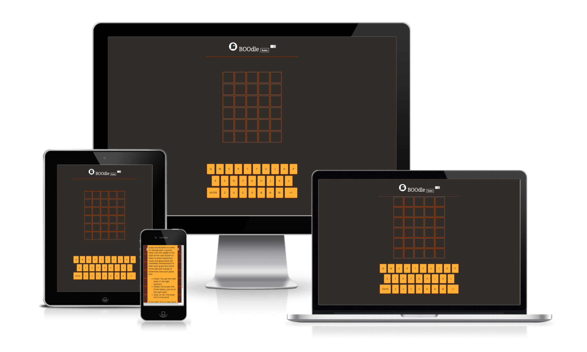
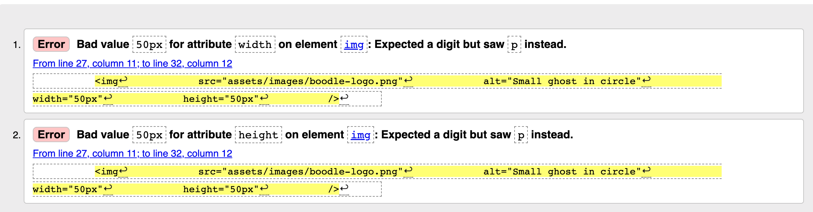
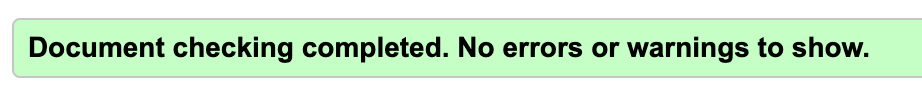

<h1> Testing For Boodle </h1>

# Table of Contents
- [Table of Contents](#table-of-contents)
  - [Manual Testing](#manual-testing)
  - [Browser Testing](#browser-testing)
  - [Device Testing](#device-testing)
  - [Validator Testing](#validator-testing)

## Manual Testing
Manual testing was done on a MacBook Pro 2015 13in, running Mojave version 10.14.6 in Google Chrome.

Feature Tested | Expected Result | Actual Result | Pass/Fail
---------------|-----------------|---------------|----------
Rules Modal | When clicked, should trigger a modal to pop up with an overlay over the rest of the screen, preventing the user from clicking anything other than the close button. | As expected | Pass
Music Toggle | When clicked, should start music playing in the background if device volume is turned on. When clicked a second time, should pause the music. | As expected | Pass
Keyboard keys | When letter is clicked, should appear in relevant tile on the grid. | As expected | Pass
Enter key | When clicked after filling a row with letters, should flip tiles and change colour of keys and tiles depending on whether a letter is in the word and in the right place, in the word but in the wrong place, or not in the word at all. | As expected | Pass
Correct word | When the correct word is entered, all tiles should flip and turn green, triggering a pop up message. | As expected | Pass
Win message | Message that pops up when you guess the correct word should contain a button which when clicked should refresh the page and reset the game. | As expected | Pass
Game over message | Should the user get the wrong word in the last row, a pop up message containing a button which when clicked should refresh the page and reset the game should appear. | As expected | Pass

## Browser Testing 
Browser Tested | Working Status
---------------|---------------
Chrome | Works as expected
Firefox | Works as expected
Microsoft Edge | Works as expected
Mac OS Safari | Works as expected

## Device Testing
Device Tested | Working Status
--------------|---------------
iPhone 8 Plus | Works as expected
Huawei Nova T5 | Works as expected
Samsung S7 | Small amount of vertical scroll as expected but still functional

## Validator Testing

Test Type | Initial Result | Pass Result
----------|----------------|------------
W3C HTML Validator |  | 
W3C CSS Validator |  | 